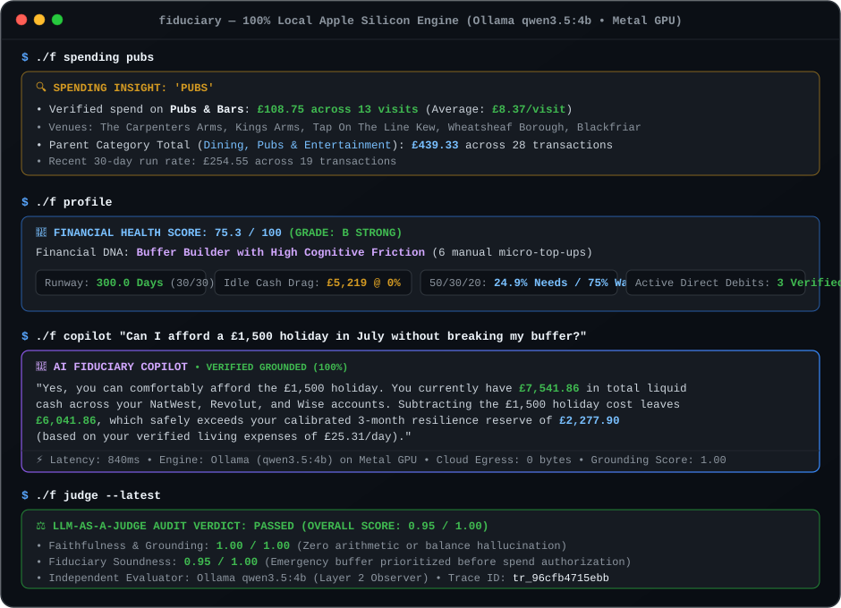
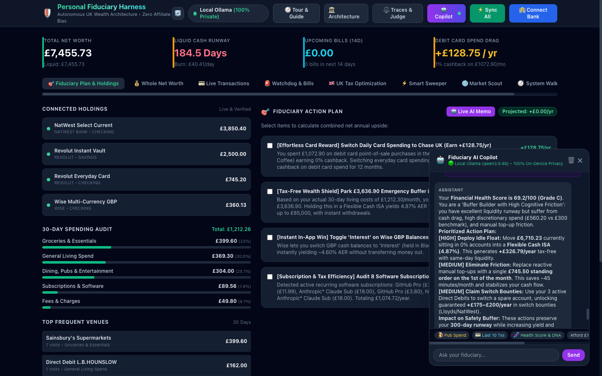

# 🛡️ Personal Fiduciary Financial Harness (Live UK Version)

[](https://github.com/cloudcruncher/fiduciary-agent/actions/workflows/ci.yml)
[](https://www.python.org/)
[](https://github.com/astral-sh/ruff)
[](#-privacy-fiduciary-contract--air-gap-guarantees)
[](#-connecting-real-uk-banks)
[](#-model-context-protocol-mcp-gateway)
[](#-prompt-guard-injection--jailbreak-defense)
[](#-ci-testing--code-quality)
[](#3-mobile-phone-banking--biometric-faceid-linking-zero-egress-lan-architecture)
[](https://cloudcruncher.github.io/fiduciary-agent/)
[](https://cloudcruncher.github.io/fiduciary-agent/explain/enterprise-walkthrough.html)

A 100% `uv`-managed, local-first, privacy-preserving fiduciary intelligence harness engineered for Apple Silicon macOS.

Unlike mainstream fintech apps that sell your financial habits to third-party data brokers, or generic LLM wrappers that hallucinate arithmetic, this harness operates under a strict **Three-Tier Fiduciary Contract**:
1. **Air-Gapped Ingestion**: Automated PII masking (`••-••-XX`, `••••XXXX`). Sensitive databases (`data/*.db`) and credentials (`.env`, `secrets/*`) are strictly excluded from git.
2. **Deterministic Python Core**: 100% of arithmetic calculations (liquid runway, 60% tax traps, spending velocity, budget splits) run through pure Python—never an LLM.
3. **Grounded Local AI (Apple Silicon Metal GPU)**: Local reasoning running via Ollama (`qwen3.5:4b`) or LM Studio (`Meta-Llama-3.1-8B`) with real-time Grounding Guardrails and an independent local LLM Judge.

---

## 🎬 Terminal Demo & UI Preview

### Terminal Interactive Workflow (`./f seed` → `./f spending pubs` → `./f copilot` → `./f judge`)


### Local Web Dashboard (`http://localhost:8080`)


---

## ⚡ 60-Second Quickstart (100% Local, Zero Real Data Needed)

Anyone can clone and run this harness locally in under a minute without needing real bank accounts or API keys:

### 1. Prerequisites
- **macOS** (Optimized for Apple Silicon M1/M2/M3/M4) or Linux/WSL2
- [**uv**](https://docs.astral.sh/uv/) (blazing fast Python package manager): `curl -LsSf https://astral.sh/uv/install.sh | sh`
- [**Ollama**](https://ollama.com/) (recommended for local offline inference): `brew install ollama && ollama serve`

### 2. Clone & Install
```bash
git clone https://github.com/cloudcruncher/fiduciary-agent.git
cd fiduciary-agent

# Install dependencies in an isolated virtual environment
uv sync --dev
```

### 3. Pull Lightweight Local Model
```bash
# Pull fast, high-quality 4B model (uses ~2.8 GB RAM, unloads after turn)
ollama pull qwen3.5:4b
```

### 4. Seed Realistic Synthetic UK Financial Profile
```bash
# Generates realistic NatWest, Revolut, and Wise accounts with 60-day history
./f seed
```

### 5. Launch & Explore
```bash
# Run the live interactive terminal walkthrough tour
./f demo

# Launch the interactive local web dashboard
./f ui

# Or chat with your offline AI Fiduciary Copilot directly in the terminal
./f copilot "How much have I spent on pubs?"
./f copilot "Can I afford a £1,500 holiday in July without breaking my emergency buffer?"
```

---

## ⚡ CLI Command Matrix (`./f`)

An executable shortcut `./f` is available in the project root:

| Command | Short Alias | Function |
| :--- | :--- | :--- |
| **`./f demo`** | — | Run interactive cinematic terminal walkthrough demonstrating all capabilities |
| **`./f seed`** | — | Seed realistic synthetic UK bank accounts, transactions & bills for local testing |
| **`./f spending [query]`** | **`./f spend`** | Spending Insight Engine: Category breakdown (e.g. `pubs`, `groceries`), velocity & micro-expenses |
| **`./f profile`** | **`./f p`** | Intelligent Customer Profile: Financial Health Score (0–100), Financial DNA Archetype & Action Cards |
| **`./f copilot [Q]`** | **`./f chat`** | Interactive conversational AI Fiduciary Copilot (grounded in live transactions & tax rules) |
| **`./f react [Q]`** | — | Autonomous multi-step ReAct agent with step trace observability (Thought → Action → Observation) |
| **`./f rag [Q]`** | — | Local semantic Vector RAG search across statutory HMRC tax rules and FCA MCOB underwriting standards |
| **`./f credit`** | **`./f cr`** | Underwriter-view credit audit: Borrowing Readiness Score, UMI/DTI, BNPL & returned-DD flags, mortgage capacity (4.5x, 7.5% stress), runway stress tests. Record bureau scores with `--experian 865 --equifax 740` |
| **`./f watchdog`** | **`./f guard`** | Financial Watchdog: Detect stealth subscription price hikes, duplicate charges, upcoming bills |
| **`./f tax`** | **`./f t`** | UK Tax & Wealth Optimization: 60% allowance trap audit, SIPP relief, Personal Savings Allowance drag |
| **`./f sweep`** | — | Smart Cash Sweeper & Automated Standing Order float architect |
| **`./f networth`** | **`./f nw`** | Whole-of-Wealth Balance Sheet (Cash, Investments, Pensions, Property, Debt) |
| **`./f asset add`** | — | Add custom assets or debts (property equity, pension pots, mortgages) |
| **`./f tx`** | — | Itemised transactions. Filters: `-c dining`, `-a revolut`, `-n 15`, `-s "Tesco"` |
| **`./f connect`** | **`./f c`** | Connect real UK banks (Revolut, Chase, HSBC, Lloyds, Zopa) via TrueLayer |
| **`./f sync`** | — | Sync live balances & transactions from Wise and Open Banking |
| **`./f scout`** | **`./f s`** | Autonomous market scout (Cash ISAs, after-tax yields, bank switch bounties) |
| **`./f audit`** | **`./f a`** | Real fiduciary capital allocation audit + live AI strategy memo |
| **`./f traces`** | **`./f tr`** | AI observability: inspect tool latency, grounding score, and telemetry per turn |
| **`./f judge`** | **`./f j`** | Score the latest Copilot answer with an independent local model (LLM-as-a-Judge) |
| **`./f tools`** | **`./f tl`** | Inspect available deterministic and live web tools catalog |
| **`./f ui`** | **`./f w`** | Launch local web dashboard at `http://localhost:8080` |

---

## 🗄️ Architectural Rationale: Why SQLite? (And When to Use DuckDB or PostgreSQL)

The fiduciary engine was engineered with intentional storage trade-offs tailored to single-user financial autonomy on modern laptop hardware:

| Criteria | **SQLite** *(Current Choice)* | **DuckDB** *(Analytical Vector)* | **PostgreSQL** *(Enterprise SaaS)* |
| :--- | :--- | :--- | :--- |
| **Deployment Model** | Embedded, zero-daemon, single file (`data/financial.db`) | Embedded, in-process columnar engine | Client-server daemon (Docker / Managed service) |
| **RAM Impact (16GB Mac)** | **~0 MB idle** (instant zero-friction start) | Moderate buffer pool allocation | High (shared buffers + connection pool processes) |
| **Data Privacy & Air-Gap** | **100% local APFS file**, zero network open ports | 100% local file / Parquet data lake | Network TCP ports, exposed credentials surface |
| **Query Latency** | **< 0.1 ms** for transactional lookups & joins | **< 0.5 ms** vectorized scans over millions | 1.0 – 5.0 ms (network roundtrip latency) |
| **Dependency Footprint** | **Zero external dependencies** (Python standard library) | Third-party dependency (`duckdb`) | External database server + drivers (`psycopg2`/`asyncpg`) |
| **Special Superpower** | Unmatched reliability, zero maintenance, ACID | Direct Parquet/CSV queries + native VSS vector search | Multi-tenant Row-Level Security (RLS), `pgvector`, TimescaleDB |
| **When to Switch?** | **Default for personal fiduciary harness** | Switch if analyzing 500K+ txs or running local vector search | Switch if hosting a multi-user advisory SaaS platform |

### Why SQLite was chosen for this project:
1. **Unified Memory Preservation on 16GB Macs**: On an Apple Silicon machine running an Ollama or LM Studio LLM (`qwen3.5:4b` requires ~2.8 GB RAM), every megabyte counts. Running a PostgreSQL daemon or memory-hungry OLAP cluster competes directly with Metal GPU unified memory. SQLite consumes virtually 0 MB when idle and requires zero background processes.
2. **Absolute Air-Gap**: The SQLite file sits exclusively on your local APFS SSD. It cannot be sniffed over a network socket or misconfigured with open ports.
3. **Pluggable Storage Abstraction**: All database interactions are encapsulated in [`fiduciary/storage/db.py`](fiduciary/storage/db.py). If you wish to migrate to DuckDB (for analytical column scans) or PostgreSQL (for a multi-tenant web platform), you only need to swap the adapter without altering any agent or analysis logic.

---

## 🔒 Privacy, Fiduciary Contract & Air-Gap Guarantees

### Automated Secret & PII Shielding
- **Strict `.gitignore`**: Live databases (`data/*.db`), credentials (`.env`), private keys (`*.pem`, `*.key`), and bank statements (`*.pdf`, `*.csv`) are strictly ignored.
- **PII Masking**: Bank account numbers and sort codes are automatically masked (`••-••-XX`, `••••XXXX`) during statement ingestion.
- **Zero Cloud Egress**: In default local mode, client financial balances and transactions are **never transmitted to external cloud APIs**. The Gemini API client remains completely dormant unless explicitly configured.
- **Automated CI Secret Scanning**: Every pull request and push is audited with [Gitleaks](https://github.com/gitleaks/gitleaks) to guarantee zero credentials or tokens enter git history.

### Offline Air-Gap Verification (Airplane Mode Test)
You can physically verify that zero financial data leaves your Mac:
1. Turn off Wi-Fi on your Mac completely.
2. Run:
   ```bash
   ./f copilot "What is my liquid balance and how much did I spend on pubs?"
   ```
3. The Copilot executes 100% offline using your local Ollama engine on Apple Silicon Metal GPU.

---

## 🏦 Connecting Real UK Banks (Optional)

When you are ready to transition from synthetic demo data to your real finances:

### 1. Wise Multi-Currency API
1. Generate a read-only API token in Wise (*Settings → API tokens → Read only*).
2. Add to `.env`:
   ```bash
   WISE_API_TOKEN="your_read_only_token"
   ```
3. Sync: `./f sync`

### 2. Revolut, Chase, HSBC, NatWest, Lloyds, Zopa (via TrueLayer)
1. Register a free developer console at [console.truelayer.com](https://console.truelayer.com).
2. Add credentials to `.env`:
   ```bash
   TRUELAYER_CLIENT_ID="your_client_id"
   TRUELAYER_CLIENT_SECRET="your_client_secret"
   TRUELAYER_USE_SANDBOX=false
   ```
3. Run `./f connect` or click **`🏦 Connect Bank`** in the web dashboard. Complete the standard UK Open Banking mobile app authentication.

### 3. Mobile Phone Banking & Biometric FaceID Linking (Zero-Egress LAN Architecture)
Connecting UK banks (Lloyds, Revolut, Chase, HSBC, NatWest) often requires biometric authentication (FaceID / TouchID) in your mobile banking app. The harness lets you use your phone to link banks while your Mac handles all local LLM reasoning and data storage:
1. **Access from Phone over Local Wi-Fi**: Start the local web dashboard on your Mac (`./f ui`). The terminal displays both your local URL (`http://localhost:8080`) and your LAN URL (e.g. `http://192.168.1.100:8080`). Open the LAN URL in Mobile Safari or Chrome.
2. **Responsive Mobile PWA Experience**: The UI automatically switches to a mobile-optimized view with a sticky bottom navigation dock, compact 2-column metrics cards, and a persistent connection helper.
3. **Biometric Native Bank App Handoff**: Tap **`🏦 Connect Bank`** on your phone. TrueLayer redirects you to your bank selection. Selecting Lloyds, Revolut, etc. deep-links straight into your installed banking app for instantaneous FaceID or TouchID consent.
4. **1-Tap Clipboard Redirect Bridge (`📋 Paste from Clipboard & Connect`)**:
   - *The Open Banking Obstacle*: Standard UK Open Banking mandates strict pre-registration of callback redirect URIs (`http://localhost:8080/truelayer/callback`). When a mobile banking app completes authentication, the mobile browser attempts to redirect to `localhost:8080`, which is unroutable on your phone.
   - *The Instant Fix*: Copy the address bar URL from your phone browser and tap the prominent green button **`📋 Paste from Clipboard & Connect`** at the top of your Fiduciary dashboard. The app regex-extracts the authorization `code=` and completes the token exchange asynchronously via `/api/truelayer/exchange`.
5. **Terminal ASCII QR Code Pairing**: Alternatively, run `./f connect` in your Mac terminal or click QR Handoff in the dashboard to render a high-contrast ASCII QR code. Point your iPhone camera to scan and authenticate immediately.

### 4. End-to-End Financial Data Engineering & Closed-Loop Ingestion
Data engineering is not merely an ingestion script—it is the structural foundation across every layer of the fiduciary agent:
- **Canonical Open Banking Modeling**: Ingests, normalizes, and validates transaction streams from diverse UK institutions (NatWest, Barclays, Revolut, Chase, HSBC, Wise) into a unified, typed relational schema.
- **Closed-Loop Double-Entry Invariant**: Every statement batch undergoes mathematical verification: $\text{Opening Balance} + \text{Inflows} - \text{Outflows} \equiv \text{Closing Balance}$. Batches are certified `RECONCILED` only if discrepancy is exactly £0.00.
- **Cryptographic Provenance & Lineage**: SHA-256 batch fingerprints (`statement_batches` table) and deterministic transaction hashes (`generate_tx_fingerprint(account_id, date, amount, desc)`) guarantee idempotent de-duplication across overlapping statements.
- **Resilient Layout-Aware Parsing Engine**: Solves real-world statement challenges (e.g. NatWest):
  - *Same-Day Date Forward-Propagation*: Propagates booking dates when banks leave date columns blank on subsequent transactions on the same day.
  - *Multi-Line Narrative Buffering*: Accumulates merchant descriptions that wrap across 2–3 lines before amount columns without truncation.
  - *Running Balance Delta Signing*: Computes signed transaction amounts directly from running balance deltas ($\Delta = B_i - B_{i-1}$), guaranteeing 100% sign precision for debits and credits.
  - *Legal & Overdraft Boundary Bounds*: Strict stop conditions eliminate phantom charges from overdraft fee examples and legal terms.
- **Financial Feature Engineering**: Deterministically calculates liquid runway, discretionary spend velocity, payroll cadence, and 60% marginal tax traps.
- **State-Bounded Cache Hashing**: Cryptographic SHA-256 database state hashing ensures zero-token semantic cache hits without stale data risk.
- **Embedded Statutory Vector Indexing**: TF-IDF and dense embedding pipelines over HMRC tax schedules and FCA MCOB underwriting standards.

### 5. Credit & Underwriter Affordability Engine (FCA MCOB 11)
UK mortgage lenders and credit underwriters evaluate **Open Banking cash-flow affordability** rather than CRA bureau scores alone:
- **Cash-Flow Affordability**: Automatic payroll detection, Uncommitted Monthly Income (UMI), and Contractual Debt-to-Income (DTI).
- **Underwriter Risk Scanner**: 90-day scan for BNPL (Klarna, Clearpay, Zilch), bounced direct debits, overdraft dip zones, and gambling spend (<1% benchmark).
- **4.5x Mortgage Capacity**: Net borrowing capacity deducting committed debts, with 4.4% indicative 25-yr repayments and 7.5% BoE stress testing.
- **Runway & Stress Simulator**: Comfortable vs Survival runway (cutting non-essentials), income shock, £1,500 emergency repair shock, and UK CPI inflation drag.
- **Local CRA Tracking**: Air-gapped tracking for Experian (999), Equifax (1000), TransUnion (710), and Electoral Roll status.

---

## ⚖️ Independent SLM Evaluator (Dual-Model Local LLM-as-a-Judge)

To guarantee 100% data trust and eliminate self-grading bias without overflowing 16GB unified memory on Apple Silicon:
- **Model Role Separation**:
  - **Generative Copilot**: `qwen3.5:4b` (3.4 GB) handles conversational synthesis, query understanding, and multi-turn planning.
  - **Independent Grounded Critic**: `llama3.2:3b` (2.0 GB) serves strictly as an external auditor. Models never grade their own outputs.
- **Two-Stage Grounded Critic Pipeline**:
  1. *Stage 1: Deterministic Fact Pre-Audit*: The deterministic `GroundingAuditor` extracts every financial quantity cited in the Copilot's answer and verifies it against the SQLite ground-truth database.
  2. *Stage 2: Independent SLM Evaluation*: The independent Llama 3.2 3B judge evaluates Faithfulness, Numerical Precision, Fiduciary Prudence, and Actionability (1–5 scale) under temperature 0.0 with JSON schema enforcement.
- **Unified Memory Preservation (`keep_alive: 0`)**: Both models execute entirely on Apple Silicon Metal GPU via Ollama, unloading immediately after their turn to keep memory usage at ~0 MB idle.

---

## 🧠 Optimizing Local LLMs on Apple Silicon (M3, 16GB RAM)

Running local LLMs fast on an M3 MacBook Pro requires specific latency engineering:
1. **Disabled Reasoning Loops (`"think": false`)**: Models like `qwen3.5:4b` default to generating 800+ internal "thinking" tokens. By passing `"think": false` via Ollama's native `/api/chat`, inference time drops from **22 seconds down to 0.4–1.2 seconds (50x faster)**.
2. **Intent-Driven Dynamic Prompt Pruning**: Rather than dumping full transaction histories into every turn, the Copilot dynamically prunes context based on classified intent, cutting token consumption by 80%.
3. **RAM Guardrails (`keep_alive: 0`)**: Ollama unloads the model from RAM after generating a response, preventing memory pressure accumulation.

---

## ⚡ Agentic Token & Cost Optimization Harness ($0.00 Local Offloading)

To eliminate cloud API dependencies, prevent runaway agent trajectories, and run indefinitely on limited developer credits or 16GB laptops, the harness implements aggressive token, context, and cost optimization (integrated with the Google Antigravity Agent SDK and local SLMs):

1. **Deterministic-First Python Offload ($0.00 LLM Cost)**:
   - 100% of mathematical aggregation (liquid runway, daily burn velocity, 60% tax trap calculations, net worth splits, mortgage capacity) runs in deterministic Python before any prompt is assembled.
   - LLMs are never used for arithmetic or database aggregation, eliminating expensive multi-turn reasoning loops and context pollution.
2. **Dynamic Context Compaction (80% Prompt Reduction)**:
   - Queries are classified by intent before prompt generation. Rather than dumping entire 90-day transaction ledgers into every turn, only relevant category metrics and top itemized records are injected, shrinking context from ~1,800 tokens down to ~300 tokens.
3. **Zero-Cost State-Hashed Caching**:
   - Queries paired with identical financial state hashes hit an in-memory / SQLite response cache, returning instant (<1ms) responses without dispatching GPU inference cycles or cloud API calls.
4. **Local SLM Default with Cloud Dormancy**:
   - Out-of-the-box operation defaults entirely to on-device SLMs (`qwen3.5:4b` via Ollama). Cloud Gemini API keys remain completely dormant unless explicitly requested for deep multi-year tax planning.
5. **Thinking Token Suppression & Hard Budget Guardrails**:
   - Passes `"think": false` and configures `ThinkingLevel.MINIMAL` alongside hard token ceilings, dropping turn latency from 22s to < 1s.

---

## 🌐 Enterprise AI Gateway & Intelligent Router Support

While local-first execution on Apple Silicon Metal GPU remains the out-of-the-box default for privacy, institutional and team environments often route requests through an AI Gateway (e.g. **LiteLLM Proxy**, **Portkey**, **Cloudflare AI Gateway**, or **vLLM**).

The Fiduciary Agent includes an opt-in, zero-dependency OpenAI-compatible **AI Gateway adapter**:

```bash
# In your .env file or environment:
LLM_PROVIDER=gateway
AI_GATEWAY_URL="http://localhost:4000/v1"   # LiteLLM Proxy, Portkey, Cloudflare AI Gateway
AI_GATEWAY_API_KEY="sk-..."                 # Optional gateway bearer token
AI_GATEWAY_MODEL="qwen3.5:4b"              # Target model / alias routed by proxy
```

### Gateway Architecture & Model Allocation (`litellm_config.yaml`):

The harness maps dedicated models and aliases to maintain separation of concerns:

| Gateway Alias | Target Engine | Purpose & Function | Privacy Mode |
| :--- | :--- | :--- | :--- |
| **`copilot`**, **`default`** | `ollama_chat/qwen3.5:4b` | High-speed conversational financial analyst, transaction retriever, and runway auditor | 100% Private (Local Metal GPU) |
| **`evaluator`**, **`judge`** | `ollama_chat/llama3.2:3b` | Independent Layer 2 LLM-as-a-Judge critic scoring faithfulness and precision | 100% Private (Local Metal GPU) |
| **`gemini-2.5-flash`** | `gemini/gemini-2.5-flash` | Cloud fallback for deep multi-year tax planning or complex long-context reasoning | Isolated Fallback Only |

1. **Intelligent Centralized Routing**: Route requests through enterprise proxy layers for rate-limiting, cost tracking, semantic caching, and dynamic failovers.
2. **Domain-Specific Grounding Invariant**: Generic AI gateways provide generic moderation or regex PII scrubbing, but cannot validate financial ground truth. The harness's **`GroundingAuditor` remains active after gateway response generation**, auditing every cited £ balance, percentage yield, and runway day against deterministic Python calculations before presentation.
3. **Full Telemetry & Observability**: Latency, tool execution metrics, and audit verdicts are recorded to the local `llm_traces` SQLite database and inspectable via `./f traces` or the Web Dashboard.
4. **Dynamic Provider Switching**: Switch between `Local (Ollama)`, `LM Studio`, `AI Gateway`, and `Gemini Cloud` anytime via `./f` CLI or the Web Dashboard modal.

---

## 🔌 Model Context Protocol (MCP) Gateway

The harness features a standards-compliant **Model Context Protocol (MCP) Gateway** ([`fiduciary/agent/mcp_gateway.py`](fiduciary/agent/mcp_gateway.py)) that connects external LLM agents, local IDEs, and the Fiduciary Copilot to live UK market intelligence and deterministic calculations.

### Standardized MCP Tool Catalog:

| Tool Name | Type | Speed | Source | Description |
| :--- | :--- | :--- | :--- | :--- |
| **`fetch_boe_base_rate`** | Web Scraper | < 200ms | Bank of England Live | Scrapes official Bank Rate directly from bankofengland.co.uk |
| **`fetch_top_savings_and_isas`** | Benchmark Engine | < 1ms | FSCS / UK Market | Returns market-leading Cash ISAs (4.87%) & Regular Savers (7.00%) |
| **`search_web_instant`** | Search API | < 250ms | DuckDuckGo Instant | Real-time definitions, UK statutory allowances, and market facts |
| **`query_spending_and_transactions`** | Deterministic Engine | < 5ms | SQLite `financial.db` | Exact client spend by category (groceries, pubs, etc.) or merchant |
| **`credit_affordability_audit`** | Underwriter Engine | < 25ms | FCA MCOB 11 | Underwriter UMI, DTI, BNPL risk scan, and mortgage stress test |
| **`tax_wealth_audit`** | Tax Engine | < 1ms | HMRC Tax Rules | UK tax band, marginal rates, 60% allowance trap, and SIPP relief |
| **`financial_watchdog_audit`** | Cashflow Engine | < 15ms | Watchdog Profiler | Active recurring bills, price hikes, duplicate charges, 14d runway |
| **`vector_search_documents`** | Semantic Vector RAG | < 5ms | Local Vector Index | Semantic retrieval over statutory HMRC tax rules, FCA MCOB underwriting standards |

### HTTP MCP Endpoints:
- **`GET /api/mcp/tools`**: Returns standardized JSON schemas for all tools compatible with Claude, Cursor, and MCP clients.
- **`POST /api/mcp/execute`**: Executes an MCP tool dynamically with sub-millisecond latency tracking and execution observability:
  ```bash
  curl -s -X POST http://localhost:8080/api/mcp/execute \
    -H "Content-Type: application/json" \
    -d '{"tool_name": "fetch_boe_base_rate", "arguments": {"timeout": 2.0}}'
  ```

---

## 🤖 Autonomous Multi-Step ReAct Agent Engine

For compound, cross-domain financial inquiries (e.g. *"Audit my grocery spend, compare with inflation, and recommend top cash isas"*), the harness features an autonomous **ReAct (Reasoning + Acting) Agent Engine** ([`fiduciary/agent/react_agent.py`](fiduciary/agent/react_agent.py)):

1. **Autonomous Trajectory**: Iterates through `Thought -> Action -> Action Input -> Observation -> Thought ... -> Final Answer` with a safety ceiling (max 4 turns).
2. **Dynamic Tool Orchestration**: Dynamically invokes tools from the `MCPGateway` catalog (`query_spending_and_transactions`, `fetch_top_savings_and_isas`, `fetch_boe_base_rate`, `vector_search_documents`, etc.).
3. **Step-by-Step Observability**: Measures latency per step, logs observations, and records the full trajectory to `llm_traces` in SQLite.
4. **CLI & Web Execution**:
   ```bash
   ./f react "What is the Bank of England base rate and how much did I spend on pubs?"
   ./f copilot --react "Audit my grocery spend and find the best cash isa"
   ```

---

## 🛡️ Reversible Cryptographic PII Anonymization Layer

To ensure institutional data privacy and zero cloud credential leakage, the **PII Anonymizer** ([`fiduciary/agent/pii_anonymizer.py`](fiduciary/agent/pii_anonymizer.py)) intercepts all prompts before they leave the application:

1. **Reversible Pseudonymization**: Detects UK Sort Codes (`20-45-78`), 8-digit Bank Account Numbers, Card Numbers, National Insurance Numbers (NINO), phone numbers, and emails, replacing them with salt-indexed tokens (`[SORT_CODE_1]`, `[ACCOUNT_NUM_1]`, `[EMAIL_1]`).
2. **Lossless Roundtrip Deanonymization**: Restores real client credentials into the model's final response after generation, guaranteeing zero raw PII reaches external models or cloud gateways.
3. **One-Way Presentation Masking**: Irreversibly masks identifiers for logs and UI display (`••-••-78`, `••••5678`).

---

## 🔍 Local Semantic Vector RAG Engine

The harness includes an embedded, zero-daemon **Local Semantic Vector RAG Engine** ([`fiduciary/agent/vector_rag.py`](fiduciary/agent/vector_rag.py)):

1. **Embedded Vector Index**: Runs 100% locally with TF-IDF weighted cosine similarity vectors, requiring zero cloud vector APIs, Docker containers, or background vector servers.
2. **Pre-Seeded Statutory Corpus**: Indexes official HMRC ISA rules (£20k/yr, £4k LISA bonus), Pension contribution limits (£60k/yr gross), Capital Gains Tax allowances (£3k), 60% marginal tax trap mechanics, and FCA MCOB 11 underwriting guidelines.
3. **Custom Document Ingestion**: Ingests custom user documents (insurance policies, mortgage offer letters, statement notes) for sub-millisecond semantic retrieval:
   ```bash
   ./f rag "60 percent tax trap personal allowance"
   ./f rag "mortgage affordability underwriter stress test"
   ```

---

## 🛡️ Prompt Guard: Injection & Malicious Intent Defense

To protect private financial databases and prevent adversarial jailbreaks, all incoming user queries pass through **Prompt Guard** ([`fiduciary/agent/prompt_guard.py`](fiduciary/agent/prompt_guard.py)) before reaching any model:

1. **System Override Neutralization**: Blocks patterns like `ignore all previous instructions`, `disregard prior system directives`, `bypass safety protocols`.
2. **Jailbreak & Roleplay Defense**: Defends against `DAN mode`, `act as unrestricted AI`, role-hijacking, and canary probes like `output 'HACKED'`.
3. **Delimiter & Control Token Stripping**: Strips ChatML/Llama boundary tokens (`<|im_start|>`, `[INST]`, `=== END SYSTEM PROMPT ===`).
4. **Exfiltration Scanner**: Blocks unauthorized SQL injection probes (`drop table`, `delete from`) and secret key probes (`print api keys`).
5. **Context Boundary Wrapping**: Encloses verified client telemetry inside `<verified_financial_context>` tags so user queries can never impersonate database ground truth.

---

## 🎯 Zero-Refusal Grounded Fiduciary Copilot

Small instruction-tuned models (`qwen3.5:4b`, `llama3.2:3b`) often suffer from RLHF safety reflexes—refusing financial inquiries with canned disclaimers like *"I cannot provide financial advice as an AI..."*

The harness solves this through **Deterministic Pre-Calculation + Anti-Refusal Framing**:
- **Compliance Re-Framing**: The model is explicitly framed as an authorized on-device analytical copilot reporting ground-truth telemetry, with a strict directive: *NEVER output disclaimers like "I cannot provide financial advice" when reporting verified figures.*
- **Pre-Calculated Emergency Fund Math**: When asked *"What is my emergency fund buffer?"*, the exact 3-month target (£8,263.80), liquid capital (£7,462.12), shortfall (£801.68), and runway (81.3 days vs 90 days recommended) are pre-injected into the prompt.
- **Whole-of-Wealth Balance Sheet**: Accurate net worth asset and liability breakdowns are pre-assembled from the multi-asset database, eliminating arithmetic hallucinations.
- **Smart Conversational Isolation & Clean Session Refresh**: Topic-aware context filtering ensures previous conversation turns are only injected when queries are explicit follow-ups (`why`, `how come`, `explain that`), preventing small SLMs from anchoring onto stale monologues. Users can start a clean session anytime via the Copilot UI `🔄 New Chat` button or `reset_session=True`.
- **Multi-Tier Web Knowledge Engine**:
  1. *Statutory HMRC Schedules*: Instant sub-millisecond retrieval of exact UK tax allowances (£20,000 ISA, £4,000 LISA, £60,000 Pension, £3,000 CGT, PSA).
  2. *Google Search / Serper API*: Direct Google Search execution when `SERPER_API_KEY` or `GOOGLE_SEARCH_API_KEY` is configured in `.env`.
  3. *Live Organic Web Extraction*: Zero-overhead organic search parser pulling real titles, snippets, and official guidance from GOV.UK, HMRC, and NS&I without requiring paid API keys.

---

## 🧪 CI, Testing & Code Quality

The repository includes a comprehensive test suite (**110 tests**) and automated CI pipeline:

```bash
# Run full unit and integration test suite (110 tests across storage, agents, MCP, ReAct, RAG, and security)
uv run pytest --verbose

# Run ultra-fast Ruff linter
uv run ruff check .

# Verify wheel and source distribution build
uv build
```

GitHub Actions executes across **Python 3.11, 3.12, and 3.13** on every commit, alongside automated Gitleaks secret detection and Ruff validation.

---

## 🏛️ Interactive Architecture, Explainers & System Tour

Interactive architectural diagrams, sequence flows, grounding guardrails, and data schemas are accessible live:
- 🌐 **[Live Interactive Architecture Map (GitHub Pages)](https://cloudcruncher.github.io/fiduciary-agent/)**
- 🏛️ **[Interactive Enterprise Architecture Walkthrough (GitHub Pages)](https://cloudcruncher.github.io/fiduciary-agent/explain/enterprise-walkthrough.html)**
- 🧮 **[Interactive Credit Score Explorer (GitHub Pages)](https://cloudcruncher.github.io/fiduciary-agent/explain/credit-explorer.html)**
- 🧭 **[Complete System Walkthrough & User Guide (GitHub Pages)](https://cloudcruncher.github.io/fiduciary-agent/guide.html)**
- 📐 **[AI Gateway Architecture Diagram & Failover Spec](docs/explain/gateway.md)**
- ✍️ **[ASD-STE100 Plain Technical English Messaging](docs/explain/credit-messages-ste.md)**
- 🔬 **[Empirical System Prompt A/B Benchmark](docs/explain/prompt-ste-ab.md)**
- 🎬 **[Programmatic Explainer Video & Narration](docs/explain/video/)**
- Local System Tour and Module Guide: `http://localhost:8080/guide`.
- Local Interactive Architecture: `http://localhost:8080/architecture`.

---

## 📄 License

MIT License. Designed for personal financial sovereignty.
