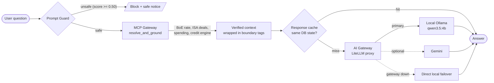

# How a question moves through the AI Gateway

**Caption.** The Prompt Guard checks each question first. The MCP Gateway then adds only verified data. The AI Gateway sends the prompt to the local model. If the gateway is down, the client calls the local model directly.

## What the code does at each step

| Step | Code | Rule |
|---|---|---|
| Prompt Guard | `fiduciary/agent/prompt_guard.py` | Each matched pattern adds 0.55 to 0.60 to the risk score. A score of 0.50 or more blocks the query. |
| MCP Gateway | `fiduciary/agent/mcp_gateway.py` | The tool is chosen from keywords in the question. Each tool call is logged. |
| Context wrap | `PromptGuard.wrap_context_boundaries` | The context sits inside `<verified_financial_context>` tags. User text cannot close these tags. |
| Cache | `LLMClient.generate` | The key is the mode, model, prompts and database state. |
| Gateway call | `LLMClient._generate_gateway` | The client posts to `/chat/completions`. |
| Failover | `LLMClient.generate` | The client falls back to the local or Gemini path. |

## Notes from reading the code

- The Prompt Guard matches fixed patterns. It does not catch paraphrased attacks. Treat it as a first filter, not a full defence.
- The cache key includes the model, parameters, verified context, and system prompt. Changes to system instructions or context trigger clean cache misses.
